# QR Code Examples

## URL


`https://example.com`

## E-Mail

### Plain E-Mail


`john.doe@example.com`

### Mailto

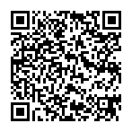

`mailto:john.doe@example.com?cc=jane.doe@example.com,john.doe@example.com,&bcc=john.doe@example.com&subject=Hello&body=Hello%20World%21`

### MATMSG

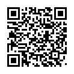

`MATMSG:TO:john.doe@example.com;SUB:Hello;BODY:Hello World!;;`

## Telephone Number


`tel:+1-123-555-4567`

## Contact Information

### vCard

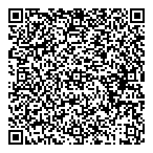

``` vcf
BEGIN:VCARD
VERSION:3.0
N:Doe;John;;Mr.;
FN:John Doe
ORG:John Doe Co.
TEL;TYPE=WORK,VOICE:(123) 555-4567
TEL;TYPE=HOME,VOICE:(765) 555-4321
ADR;TYPE=HOME:;;123 Main Street;New York;NY;10030;United States of America
LABEL;TYPE=HOME:123 Main Street\nNew York\, NY 10030\nUnited States of America
EMAIL:john.doe@example.com
REV:2020-12-24T18:00:00Z
END:VCARD
```

### MeCard

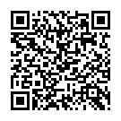

`MECARD:N:Doe,John;NICKNAME:Johnny;ORG:John Doe Co.;ADR:123 Main Street, New York, NY 10030;BDAY:19990101;TEL:1235554567;TEL:7655554321;EMAIL:john.doe@example.com;URL:https://johndoe.example.com/;NOTE:Hello World!;;`

### BizCard

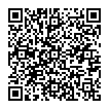

`BIZCARD:N:John;X:Doe;T:Software Engineer;C:John Doe Co.;A:123 Main Street, New York, NY 10030;B:+11235554567;M:+17655554321;E:john.doe@example.com;;`

## SMS


`sms:+11235554567,+17655554321?body=Hello%20World%21`

## Geographic Information

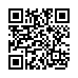

`geo:40.762573,-73.8336205,100?z=22&q=My%20Home%21`

## Calendar Event

### vEvent

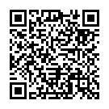

``` vevent
BEGIN:VEVENT
SUMMARY:Summer Vacation!
LOCATION:Germany
URL:https://johndoe.example.com/
DTSTART:20210607T080000Z
DTEND:20210614T080000Z
END:VEVENT
```

## Wi-Fi Network config

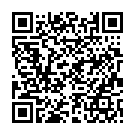

`WIFI:T:WPA2-EAP;S:John's Wi-Fi;P:supersecretp@ssword;H:true;E:TTLS;A:anaonymousIdent;I:ident;PH2:MSCHAPV2;;`

## Google Play Store App

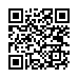

`market://details?id=com.google.android.apps.maps`

## Crypto Currency

### Bitcoin

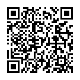

`bitcoin:175tWpb8K1S7NmH4Zx6rewF9WQrcZv245W?amount=0.1&label=John%20Doe&message=For%20you%21`

### Ethereum

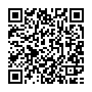

`ethereum:175tWpb8K1S7NmH4Zx6rewF9WQrcZv245W?amount=1.5&label=John%20Doe&message=For%20you%21`

> Other Crypto Currencies like `Bitcoin Cash`, `Litecoin` and `Dash` are also supported.

## SIP


`sip:1234567@example.com:1234`
